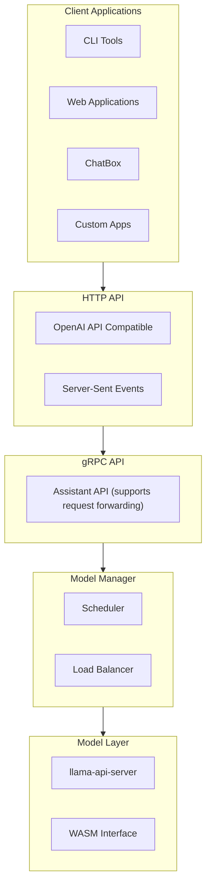

 # Assistant

A LLM service platform based on llama-api-server, providing OpenAI API-compatible HTTP interface with multi-model management and load balancing capabilities.

## System Architecture



## Key Features

- **OpenAI API Compatibility**: Fully compatible HTTP interface with OpenAI API
- **Multi-Model Support**: Deploy and manage multiple local models
- **Load Balancing**: Intelligent request distribution across available models
- **Streaming Response**: Support for Server-Sent Events streaming
- **Flexible Configuration**: Customizable model and system configurations

## Quick Start

### Install Dependencies

1. **Install WasmEdge with GGML plugin**:
   ```sh
   curl -sSf https://raw.githubusercontent.com/WasmEdge/WasmEdge/master/utils/install.sh | bash -s -- --plugins wasi_nn-ggml
   ```

2. **Download GGML model**:
   ```sh
   wget https://huggingface.co/Qwen/Qwen1.5-0.5B-Chat-GGUF/resolve/main/qwen1_5-0_5b-chat-q2_k.gguf
   ```

### Configure Service

1. **Generate default configuration**:
   ```sh
   cargo run -- --model-config
   ```

2. **Modify configuration file**:
   The configuration file is located at `/etc/assistant/config.toml`. Please refer to the default configuration for modifications:
   - Set model paths
   - Configure ports and concurrency
   - Adjust other parameters

### Start Service

```sh
cargo run
```

## Configuration Guide

### Main Configuration (/etc/assistant/config.toml)

```toml
remote_servers = []  # Remote server list

[server]
grpc_addr = "0.0.0.0:50051"  # gRPC service address
http_addr = "0.0.0.0:8080"  # HTTP service address

[scheduler]
config_dir = "/etc/assistant/models"  # Model configuration directory
max_instances = 10  # Maximum number of instances
max_load = 0.800000011920929  # Maximum load

[[llama_servers]]
name = "default"  # Model name
chat_model_path = "/home/hu/code/assistant/models/qwen1_5-0_5b-chat-q2_k.gguf"  # Chat model path
embedding_model_path = ""  # Embedding model path
tts_model_path = ""  # TTS model path
port = 8000  # Service port
config_path = "/home/hu/code/assistant/default.toml  # Configuration file path
```

### Model Configuration

Use `--model-config` to generate default model configuration with the following main parameters:
- `name`: Model name
- `model_path`: Path to model file
- `port`: Service port
- `ctx_size`: Context size
- `batch_size`: Batch size

## Development Roadmap

- [ ] RAG (Retrieval-Augmented Generation) support
- [ ] Lower-level WASM interface for better performance
- [ ] gRPC model download support
- [ ] Optimize support for high-concurrency models
- [ ] MCP protocol support for client tools
- [ ] Enhanced configuration options
- [ ] Enhanced the blance scheduler

## Project Structure

- `src/`: Main program source code
- `crates/`: Core modules
  - `scheduler/`: Model scheduler
  - `grpc-server/`: gRPC service
  - `http-server/`: HTTP service
  - `protos/`: Protocol definitions

## License

MIT License