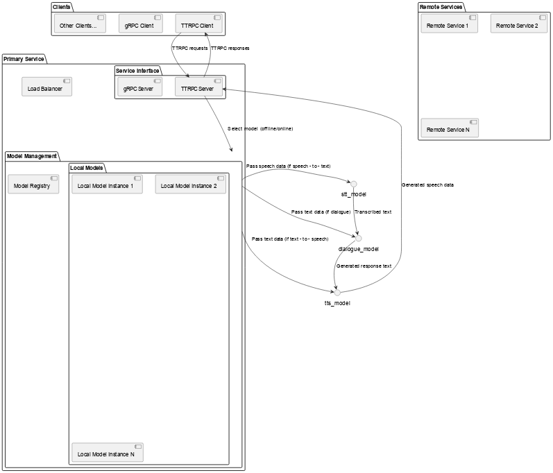
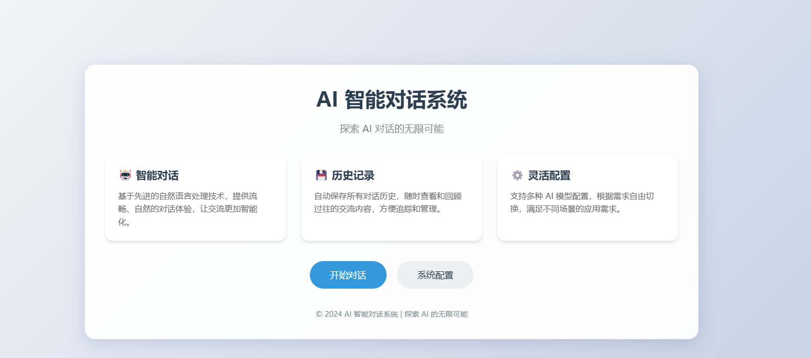
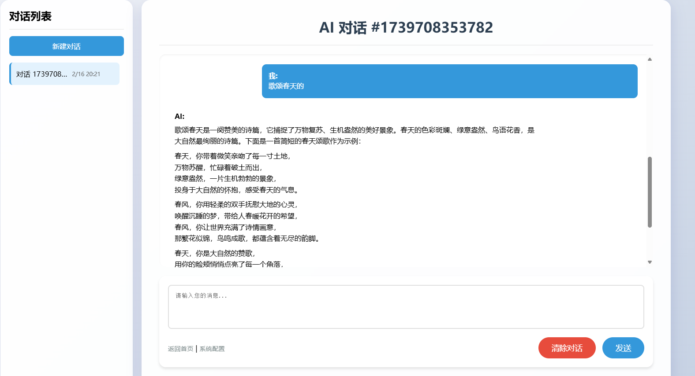

# Assistant

## Project Overview

This project implements a C-S AI assistant. 
1.support offline and online AI implement. 
2.support multiple clients.
3.support multiple models.
4.support multiple services.

## Todo

client:
- [ ] Add a GUI client
- [ ] Add a web client
- [ ] Add a CLI client

service:
- [ ] Add Stream support
- [ ] Add Prompt support
- [ ] Add Model support
- [ ] Add Service support


## Design
service(Outdated):

Local Model:
Use wasm to implement the local model. For example, the local model can be a llama3.1 model. Or These models which can quantization by ggml.


## Usage

### 1. Service

The service module handles the core functionality of the voice assistant. To run the service, follow these steps:

#### 1.1. Install Dependencies

Make sure you have Rust and Cargo installed. Then, navigate to the project root and run:

``` sh
cargo run --bin service
```

#### 1.2. Configure API Key

In the `src/service/src/default.toml` file, locate the line where the API key is set and replace `<your_api_key>` with your actual API key.

#### 1.3. Run the Service

To start the service, run the following command from the project root:
#### 1.4. Choose the model

You can choose the model in the `src/service/src/default.toml` file.

``` toml
[dialogue_model]
model_path="https://api.siliconflow.cn/v1/chat/completions"
api_key= ""
model_name= "Qwen/Qwen2.5-7B-Instruct"
stream = true
prompt_path= ""
```

### 2. Client

The client module provides multiple binaries for different use cases. Below are instructions for each client type.

#### 2.1. Web Client

The web client provides a simple HTML interface for user interaction.

##### 2.1.1. Run the Web Client

To start the web client, run:
``` sh
cargo run --bin web
``` 
You can then access the web interface at `http://127.0.0.1:3030/config`.

example:



#### 2.2. CLI Client

The command-line interface client allows you to interact with the service via the terminal.

##### 2.2.1. Run the CLI Client

To start the CLI client, run:
``` sh
cargo run --bin cli
```
Follow the prompts to input your audio data and receive responses.

#### 2.3. GUI Client (if applicable)

If you have a GUI client implemented, you can run it similarly:
``` sh
cargo run --bin gui
``` 


### 3. Protos

The `protos` directory contains Protocol Buffers definitions used for communication between the service and clients. Ensure that you compile the proto files if you make any changes.

## Notes

- Ensure that your system has a working microphone. If the microphone is not detected or not functioning properly, the voice-to-text module will not be able to capture audio data.
- Adjust the audio data processing logic as needed, especially for buffering and chunking. Different microphones and audio devices may have varying sample rates and formats, so you may need to adjust the code accordingly.
- The audio playback implementation may need to be adjusted based on the audio playback library you choose. The current project uses `rodio` for audio playback, but you can select other libraries as needed.

## Contributing

Contributions are welcome! Please submit issues or pull requests.

## License

This project is licensed under the MIT License. See the LICENSE file for more details.