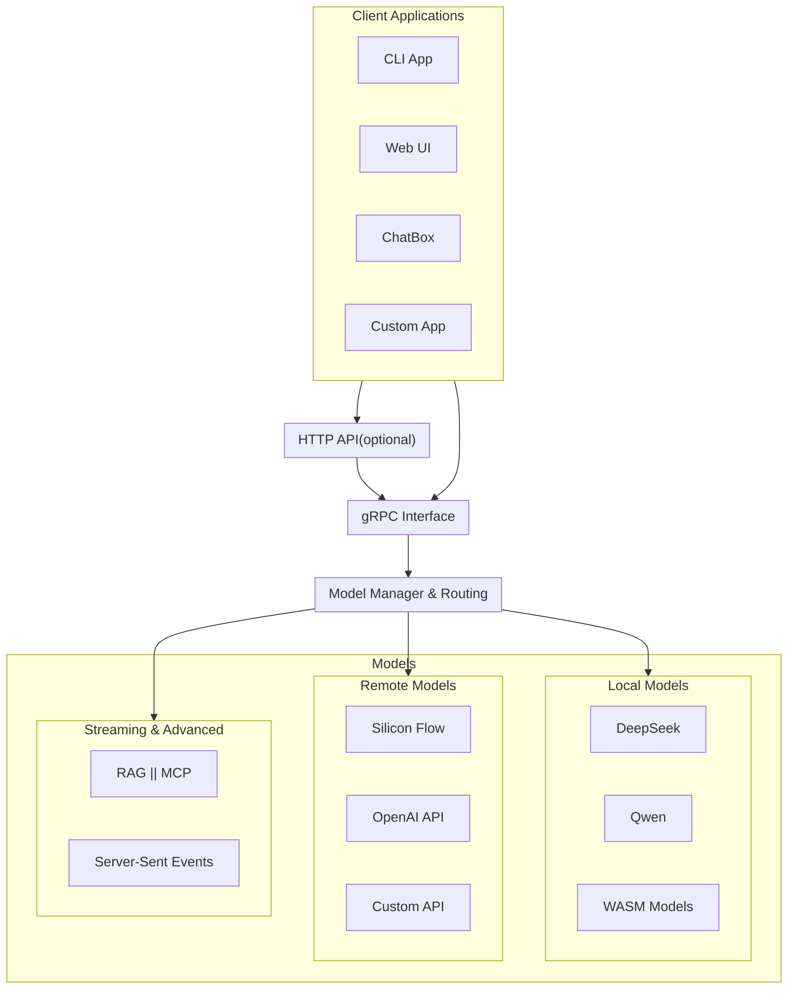
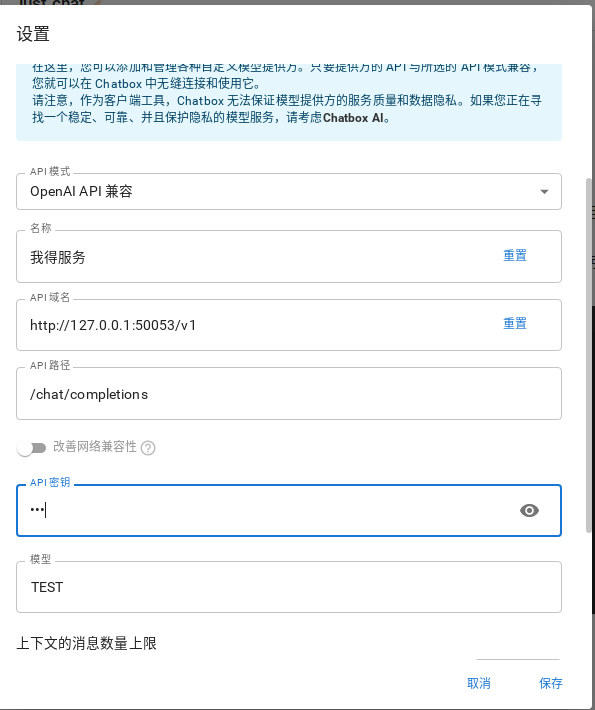

# Assistant

A powerful LLM service platform that connects multiple AI models via gRPC, enabling seamless deployment and load balancing across various environments.

## Core Vision

To create a unified AI interface that abstracts away model-specific details, allowing users to focus solely on their queries and receiving quality responses without concerning themselves with backend implementation details.

## System Architecture



## Key Features

- **Model Abstraction**: Users interact with a unified API, regardless of the underlying model
- **Multiple Model Support**: Deploy and manage local, remote, and third-party models
- **Load Balancing**: Intelligently distribute queries across available models
- **Streaming Response**: Support for real-time streaming of model outputs
- **Extensible Architecture**: Easily add new models and services as they become available

## Getting Started

### Running the Service

The service supports multiple local models, remote services, and streaming capabilities.

1. **Install WasmEdge with GGML plugin**:
   ```sh
   curl -sSf https://raw.githubusercontent.com/WasmEdge/WasmEdge/master/utils/install.sh | bash -s -- --plugins wasi_nn-ggml
   ```

2. **Download GGML model**:
   ```sh
   wget https://huggingface.co/Qwen/Qwen1.5-0.5B-Chat-GGUF/resolve/main/qwen1_5-0_5b-chat-q2_k.gguf
   ```

3. **Build WASM-GGML**:
   ```sh
   cd wasmedge-ggml
   rustup target add wasm32-wasi
   cargo build --target wasm32-wasi --release
   ```

4. **Generate default configuration**:
   ```sh
   mkdir -p /etc/assistant/service
   cargo run -p assistant-service config > /etc/assistant/service/config.toml
   ```

5. **Start the service**:
   ```sh
   cargo run -p assistant-service
   ```

### Configuration

Edit the configuration file located at `/etc/assistant/service/config.toml` to:
- Add your API keys for remote services
- Configure local models
- Set up load balancing preferences
- Enable or disable specific features

### Supported Models

#### Local Models
- DeepSeek-AI (Chat mode)
- Qwen (Chat mode)
- Custom WASM-based models

#### Remote Models
- Silicon Flow
- Other API-based services (configurable)

#### Coming Soon
- Audio models (ChatTS, Whisper)
- Vision models

## Client Usage

Multiple client implementations are available:

- **CLI Client**: `cargo run -p assistant-client`
- **Web Interface**: Build with `http_api` feature
- **ChatBox Integration**: Configure as shown below:



For detailed client instructions, see 
[client README](./src/client/README.md).

## Project Structure

- **Service**: Core functionality, model management, API interfaces
- **Client**: Reference implementations for connecting to the service
- **Plugins**: Extensibility modules for additional features
- **Protos**: gRPC protocol definitions

## Contributing

We welcome contributions! Please submit issues or pull requests on GitHub.

## License

This project is licensed under the MIT License. See the LICENSE file for details.