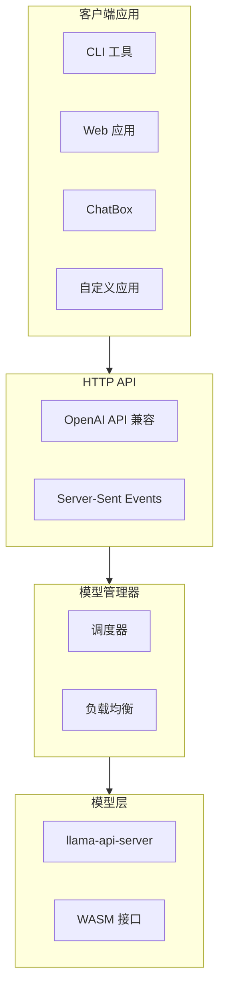

# Assistant

一个基于 llama-api-server 的 LLM 服务平台，提供 OpenAI API 兼容的 HTTP 接口，支持多模型管理和负载均衡。

## 系统架构



## 主要特性

- **OpenAI API 兼容**: 完全兼容 OpenAI API 的 HTTP 接口
- **多模型支持**: 支持部署和管理多个本地模型
- **负载均衡**: 智能分配请求到可用模型
- **流式响应**: 支持 Server-Sent Events 流式输出
- **配置灵活**: 支持自定义模型配置和系统配置

## 快速开始

### 安装依赖

1. **安装 WasmEdge 和 GGML 插件**:
   ```sh
   curl -sSf https://raw.githubusercontent.com/WasmEdge/WasmEdge/master/utils/install.sh | bash -s -- --plugins wasi_nn-ggml
   ```

2. **下载 GGML 模型**:
   ```sh
   wget https://huggingface.co/Qwen/Qwen1.5-0.5B-Chat-GGUF/resolve/main/qwen1_5-0_5b-chat-q2_k.gguf
   ```

### 配置服务

1. **生成默认配置**:
   ```sh
   cargo run -- --model-config
   ```

2. **修改配置文件**:
   配置文件位于 `/etc/assistant/config.toml`，请参照默认配置进行修改：
   - 设置模型路径
   - 配置端口和并发数
   - 调整其他参数

### 启动服务

```sh
cargo run
```

## 配置说明

### 主配置文件 (/etc/assistant/config.toml)

```toml
remote_servers = []  # 远程服务器列表

[server]
grpc_addr = "0.0.0.0:50051"  # gRPC 服务地址
http_addr = "0.0.0.0:8080"  # HTTP 服务地址

[scheduler]
config_dir = "/etc/assistant/models"  # 模型配置目录
max_instances = 10  # 最大实例数
max_load = 0.800000011920929  # 最大负载

[[llama_servers]]
name = "default"  # 模型名称
chat_model_path = "/home/hu/code/assistant/models/qwen1_5-0_5b-chat-q2_k.gguf"  # 聊天模型路径
embedding_model_path = ""  # 嵌入模型路径
tts_model_path = ""  # 语音模型路径
port = 8000  # 服务端口
config_path = "/home/hu/code/assistant/default.toml  # 配置文件路径
```

### 模型配置

使用 `--model-config` 生成默认模型配置，包含以下主要参数：
- `name`: 模型名称
- `model_path`: 模型文件路径
- `port`: 服务端口
- `ctx_size`: 上下文大小
- `batch_size`: 批处理大小

## 开发计划

- [ ] 支持 RAG (检索增强生成)
- [ ] 使用更底层的 WASM 接口，提升性能
- [ ] 支持 gRPC 模型下载
- [ ] 优化大量并发模型的支持
- [ ] 客户端工具支持 MCP 协议
- [ ] 完善配置项
- [ ] 优化负载均衡调度器

## 项目结构

- `src/`: 主程序源码
- `crates/`: 核心模块
  - `scheduler/`: 模型调度器
  - `grpc-server/`: gRPC 服务
  - `http-server/`: HTTP 服务
  - `protos/`: 协议定义

## 许可证

MIT License